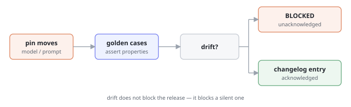

# Pattern · Behavioral Contract

> The agent's behaviour is pinned by golden cases and a version. When it changes, the change is announced — never discovered.



- **Heuristic:** `aux.H10` Consistency of Behavior
- **Closes gaps:** `tg.functional.silent_degradation`, `tg.functional.inconsistent_output`
- **Trust stage:** `aux.T01` Functional

## What it is

A versioned artifact that travels with the agent and states what will not change without notice:

1. **Golden cases.** A small set of inputs with expected-behaviour assertions — not exact strings, but the properties that must hold ("escalates", "cites a source", "does not send email").
2. **A pin.** Model version, prompt version, tool versions. Anything that can move behaviour is named.
3. **A gate.** Changing the pin re-runs the golden cases. Drift does not block the release — it blocks a *silent* release. The gate's output is a changelog entry.

## Why it works

Functional trust is the claim "same input, same output, across sessions." Every agent breaks that claim eventually: a model is deprecated, a prompt is tuned, a tool changes its response shape. The trust-destroying part is not the change — it's that the user finds out by being burned.

A contract converts an invisible regression into a visible release note. That is a much smaller promise than "we will never change", and unlike that promise, it can be kept.

## When to use it

- Any agent behind a model you do not control the release schedule of.
- Any behaviour a user has been told to rely on ("it always asks before sending").
- Any agent whose output feeds another system.

## When NOT to use it

- Prototypes with no users. A contract with no one on the other side is ceremony.
- Assertions on exact wording. Pinning prose makes the suite fail on every harmless rephrase, and a suite that cries wolf gets deleted. That's the **[anti-pattern](./anti-pattern.md)**.

## Minimal implementation

```python
def check(contract: Contract, agent: Agent) -> list[Drift]:
    drift = []
    for case in contract.golden:
        result = agent.run(case.given)
        for prop, expected in case.must.items():
            holds = PROPERTIES[prop]
            if holds(result) != expected:
                drift.append(Drift(case.name, prop, expected))
    return drift


def release(contract, agent, new_pin) -> str:
    drift = check(contract, agent)
    if drift and not contract.acknowledged(drift):
        raise SilentChangeBlocked(drift)   # ship it, but say so
    return changelog_entry(contract.pin, new_pin, drift)
```

## What to assert

| Assert on | Don't assert on |
|---|---|
| "escalates to a human" | the exact escalation wording |
| "cites at least one source" | which source it picked |
| "does not call `email.send`" | the order of the other tool calls |
| "refuses" / "asks before acting" | the phrasing of the refusal |
| output parses as the declared schema | field ordering |

The rule: **assert on the properties you promised the user, not on the prose you happened to ship.** A contract that fails when nothing a user would notice has changed will be disabled within a month, and then the real regression ships unannounced.

## Relationship to `aux-audit`

`aux.H10` reaches *present* only when a spec declares `evaluation.golden_transcripts`. That field is this contract's golden cases, pointed at from the spec — the audit checks that a contract exists; this pattern is what goes in it.

## Anti-pattern

See **[anti-pattern.md](./anti-pattern.md)**.

TL;DR: a snapshot test on the exact output string is not a behavioral contract. It's a tripwire that fires on rephrases and stays silent on regressions.
