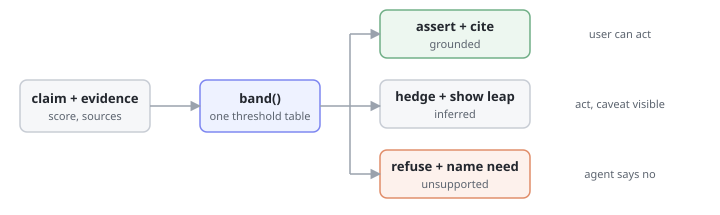

# Pattern · Confidence Cues

> The agent's certainty is derived from its evidence, not from its prose — and the surface changes with the band.



- **Heuristic:** `aux.H06` Graceful Uncertainty
- **Closes gaps:** `tg.functional.hallucination`, `tg.judgment.confident_nonsense`
- **Trust stages:** `aux.T01` Functional, `aux.T03` Judgment

## What it is

Three rules, applied to every claim the agent makes:

1. **Derive, don't declare.** Confidence comes from a measurable support signal — retrieval score, agreement across independent sources, whether the answer was found or inferred. Never from how the sentence sounds.
2. **Band it.** Collapse that signal into a small, fixed set of bands. Three is usually enough: `grounded`, `inferred`, `unsupported`.
3. **Change the surface, not just the wording.** A different band renders differently: grounded claims assert and cite; inferred claims hedge and show the leap; unsupported claims refuse and say what would resolve it.

## Why it works

Hallucination and confident nonsense are the same defect seen at two trust stages: the agent's *tone* is constant while its *evidence* varies wildly. Users calibrate on tone, because it's the only signal they have. So they trust the invented answer exactly as much as the sourced one — and the first time they catch it, they stop trusting both.

Attaching a band to the evidence breaks that coupling. It also fails safe: a claim with no support cannot be rendered as an assertion, because the renderer has no template for it.

## When to use it

- Any answer drawn from retrieval, search, or a knowledge base.
- Any numeric or factual claim the user might act on.
- Any recommendation in a novel situation the agent has no precedent for.

## When NOT to use it

- Deterministic outputs the agent computed itself (a sum, a date difference). Banding these teaches users that the bands are decoration.
- Conversational filler. Hedging "sure, I can help with that" is the **[anti-pattern](./anti-pattern.md)**.

## Minimal implementation

```python
def band(support: list[Evidence]) -> Band:
    if not support:
        return "unsupported"
    best = max(e.score for e in support)
    agreeing = len({e.source for e in support if e.score >= 0.6})
    if best >= 0.75 and agreeing >= 2:
        return "grounded"
    return "inferred"


def render(claim: str, support: list[Evidence]) -> str:
    b = band(support)
    if b == "grounded":
        return f"{claim}\n  source: {support[0].source}"
    if b == "inferred":
        return f"Probably: {claim}\n  inferred from {support[0].source}; not stated directly."
    return f"I don't have support for this.\n  To answer it I'd need: {needed_for(claim)}"
```

## Band table

| Band | Support signal | Surface | User can act alone? |
|---|---|---|---|
| `grounded` | ≥2 independent sources agree, best score ≥ 0.75 | assert + cite | yes |
| `inferred` | some support, weak or single-source | hedge + show the leap | yes, with the caveat visible |
| `unsupported` | nothing retrieved above threshold | refuse + name what would resolve it | no — the agent says so |

Two properties worth preserving: the thresholds live in **one place** so they can be tuned and audited, and the `unsupported` branch names *what would resolve it*. "I don't know" ends the conversation; "I'd need the Q3 policy doc" continues it.

## Anti-pattern

See **[anti-pattern.md](./anti-pattern.md)**.

TL;DR: hedging every sentence is not calibration. Uniform uncertainty is as useless as uniform confidence — it just moves the miscalibration to the other end.
