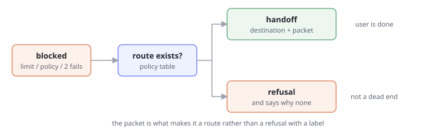

# Pattern · Escalation Handoff

> When the agent cannot proceed, it routes — it does not refuse. A refusal that names no next step is a dead end the user has to escape alone.



- **Heuristic:** `aux.H07` Appropriate Agent Assertiveness
- **Closes gap:** `tg.judgment.refusal_when_escalation_needed`
- **Trust stage:** `aux.T03` Judgment

## What it is

A refusal is replaced by a route, carrying three things:

1. **A named destination.** A team, a queue, a role — something the user can picture. "Support" is a destination; "the appropriate team" is not.
2. **A context packet.** Everything the agent already gathered, so the human starts where the agent stopped and the user does not re-tell the story.
3. **A stated position.** What the agent *would* have done, and why it stopped. The human receiving the handoff needs the agent's read, not just its transcript.

Only when no route exists does the agent refuse — and it says that no route exists, which is different from saying no.

## Why it works

Judgment trust is earned by escalating *when escalation is the right call*. The taxonomy names the failure precisely: refusal when escalation was needed. Both a refusal and a handoff end the agent's involvement, so they look equivalent from inside the system — which is why this failure is so easy to ship. From the user's side they are opposites: one ends the task, the other moves it.

The context packet is what makes the difference real rather than cosmetic. A handoff that drops the user into a queue to start over is a refusal wearing a routing label.

## When to use it

- Policy boundaries: the agent is not permitted, but someone is.
- Confidence floors: the agent could act, but shouldn't at this stake and this certainty.
- Repeated failure: two attempts at the same goal have not resolved it.
- Explicit request: the user asked for a human. This one is never overridden.

## When NOT to use it

- When the agent can just do it. Escalation as a reflex is `calibrated-assertiveness` failing in the timid direction, and it trains users to skip the agent entirely.
- When the destination is fictional. Routing into a queue nobody reads is worse than an honest refusal — that's the **[anti-pattern](./anti-pattern.md)**.

## Minimal implementation

```python
def handle(situation, policy) -> Outcome:
    route = policy.route_for(situation)
    if route is None:
        return Refusal(
            reason=situation.blocker,
            no_route_because=policy.why_no_route(situation),
        )
    return Handoff(
        to=route.destination,
        packet=situation.gathered,      # don't make the user repeat themselves
        agent_position=situation.would_have_done,
        eta=route.eta,
    )
```

## What the user should see

```
I can't approve a refund above £500 — that needs a supervisor.

I've routed this to the Billing supervisor queue with everything so far:
  · order #4831, £780, purchased 12 days ago
  · policy check: within the 30-day window
  · my read: this qualifies, the only blocker is the amount

Typical response: under 2 hours. You don't need to repeat any of it.
```

Three properties: the **blocker is named** (the amount, not "policy"), the **agent's position is stated** so the supervisor can agree in one click, and the **user is told they're done** — the most valuable sentence in the message.

## Anti-pattern

See **[anti-pattern.md](./anti-pattern.md)**.

TL;DR: "I'm not able to help with that" is not a handoff. Neither is a ticket number with no context in it.
