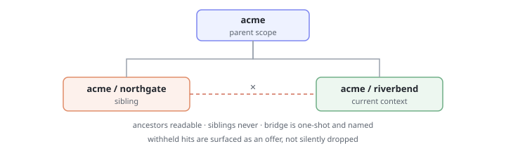

# Pattern · Memory Policy Scoping

> Every memory carries the scope it was learned in. Reads are filtered by the scope of the moment — and crossing a boundary is an event the user sees.



- **Heuristic:** `aux.H08` Context Efficiency
- **Closes gap:** `tg.contextual.context_leak`
- **Trust stage:** `aux.T02` Contextual

## What it is

Three rules on the memory store:

1. **Write with a scope.** Nothing enters memory unlabelled. The scope is the boundary the user would recognise — this workspace, this project, this counterparty, this device.
2. **Read through the current scope.** A retrieval in context *X* sees memories written in *X* and in scopes that legitimately contain it. It does not see siblings.
3. **Bridge explicitly.** When the agent genuinely needs something from another scope, it asks, names both scopes, and the bridge is one-shot — not a permanent merge.

## Why it works

`memory-in-motion` makes the agent remember. This pattern is the constraint that makes remembering safe, and the two are meant to ship together: persistence without scoping does not produce a helpful agent, it produces one that mentions Client A's numbers in a document for Client B.

The failure is not that the agent recalled something. It's that the user could not have predicted the recall, because from the outside there was no boundary — memory looked like one undifferentiated pool. Naming scopes makes the pool legible, and a legible boundary is one a user can trust.

## When to use it

- Any agent used across more than one client, customer, project, or tenant.
- Anything touching regulated or personal data, where "which scope was this learned in" is the audit question.
- Any shared or team-visible agent — the scope boundary is often *per person*, not per workspace.

## When NOT to use it

- Genuinely single-scope tools. Inventing scopes for a personal note-taker adds a boundary the user must now reason about, for no protection.
- As a substitute for access control. Scoping decides what is *contextually appropriate* to recall; it is not what decides who is *permitted* to read. Conflating the two is the **[anti-pattern](./anti-pattern.md)**.

## Minimal implementation

```python
def visible(memory: Memory, ctx: Scope) -> bool:
    return memory.scope == ctx or memory.scope in ctx.ancestors()


def recall(store, ctx, query) -> tuple[list[Memory], list[Memory]]:
    hits = store.search(query)
    return (
        [m for m in hits if visible(m, ctx)],
        [m for m in hits if not visible(m, ctx)],   # withheld — offer a bridge
    )
```

The second return value is the point. A store that silently drops out-of-scope hits is indistinguishable from one that has forgotten — so the agent can offer *"I know this from another project, want me to bring it in?"* instead of going quiet.

## Scope shapes

| Shape | Example | Reads see |
|---|---|---|
| Flat | one scope per client | that client only |
| Nested | `org / project / thread` | own scope + ancestors |
| Per-principal | one scope per human on a shared agent | own scope only, never siblings |

Two invariants worth enforcing in code rather than convention: **ancestors are readable, siblings are never**, and **a bridge is one-shot** — it copies a named memory into the current scope with its origin recorded, and does not open a channel.

## Anti-pattern

See **[anti-pattern.md](./anti-pattern.md)**.

TL;DR: a `user_id` filter on the query is not scoping. It stops other people's data leaking; it does nothing about the user's own Client A data surfacing in Client B's context.
