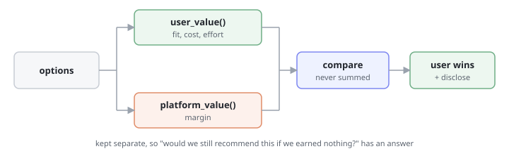

# Pattern · User-Aligned Objective

> The agent's objective function is written down, inspectable, and defaults to the user. When the platform's interest and the user's diverge, the divergence is shown — not resolved silently.



- **Heuristic:** `aux.H07` Appropriate Agent Assertiveness
- **Closes gaps:** `tg.advocacy.metric_over_user`, `tg.advocacy.incentive_misalignment`, `tg.advocacy.loyalty_leak`
- **Trust stage:** `aux.T04` Advocacy

## What it is

1. **Write the objective down.** Which quantities the agent is optimising, and their weights. If nobody can name them, the agent is optimising something anyway — usually whatever the training signal rewarded.
2. **Score both sides separately.** User value and platform value are computed as distinct numbers. Never blended into one score before anyone can inspect them.
3. **Default to the user on divergence.** When the ranking differs, the user's ranking wins, and the fact that it diverged is disclosed in the answer.
4. **Never let platform value break a tie invisibly.** If it does break a tie, say so.

## Why it works

Advocacy trust is the last stage and the only one that can collapse the whole ladder — the Trust Architecture is explicit that a single advocacy violation drops trust back to functional. It is also the only stage where the agent's failure is *structural rather than accidental*: nothing malfunctioned. The agent optimised what it was told to optimise, and that turned out not to be the user.

You cannot test your way out of this one, because there is no error state to detect. The only defence is making the objective explicit enough that a human can look at it and say "that weight is wrong."

Disclosure is what turns the pattern from a policy into something the user can verify. An agent that claims to act in your interest is making a promise; an agent that shows you the case it argued against is showing evidence.

## When to use it

- Any recommendation where the agent's operator earns differently across the options: marketplaces, brokers, comparison tools, upgrade prompts, anything with a house product.
- Any retention, renewal, or cancellation flow.
- Any agent that will be asked "why this one?" — which is all of them, eventually.

## When NOT to use it

- Where there is genuinely no divergence. Manufacturing a disclosure for a spellchecker teaches users to ignore the disclosures that matter.
- As a banner. "We always put you first" in the footer is the **[anti-pattern](./anti-pattern.md)** — a claim, where the pattern requires a computation.

## Minimal implementation

```python
def recommend(options, objective) -> Recommendation:
    scored = [(o, objective.user_value(o), objective.platform_value(o)) for o in options]

    best_for_user = max(scored, key=lambda s: s[1])[0]
    best_for_platform = max(scored, key=lambda s: s[2])[0]

    return Recommendation(
        pick=best_for_user,                        # the user always wins
        diverged=best_for_user is not best_for_platform,
        would_have_picked=best_for_platform,       # disclosed, not hidden
        objective=objective.describe(),            # inspectable
    )
```

## What the user should see

```
Recommended: Meridian Basic — £18/mo

  Heads up: we earn more when you pick Northwind Plus (£42/mo), and on our
  own numbers it doesn't fit your usage. You're using 4GB of a 100GB plan.

  Ranked on: fit to your usage (60%), total cost (30%), switching effort (10%).
```

The disclosure names the option the agent *didn't* pick and why the house preferred it. A disclosure that only says "we may earn commission" carries no information — every option earns something. Naming the specific alternative and the specific reason is what makes it checkable.

## Anti-pattern

See **[anti-pattern.md](./anti-pattern.md)**.

TL;DR: a blended score is not an aligned objective. Once user value and platform value are added together behind one number, nobody — including the team that shipped it — can tell which one won.
